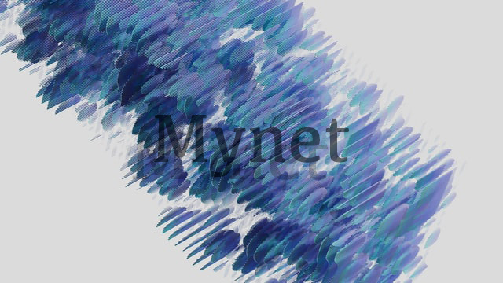
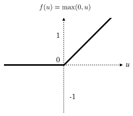
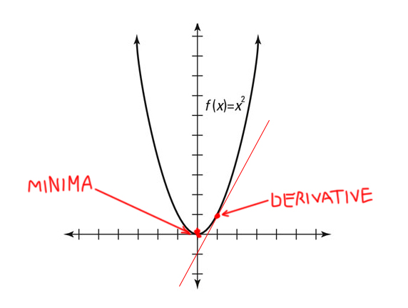
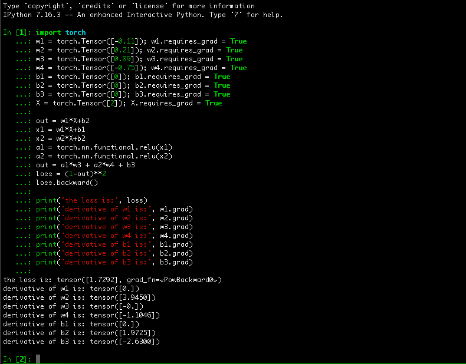

# Mynet


Education purposes library that will help you understand how neural networks work under the hood.

It is and always will be 100% dependency free, pure Python from scratch. All major components of neural networks (e.g. auto differentiation, loss functions, activation functions, optimizers) are implemented 😌 If you wish to add a new component – PR's are welcome 🙏🏻 If you found a bug in the code or you see that Mynet works incorrectly - please open an issue 👍

Absolutely not suitable for production as it's slow as hell and definitely won't be able to run a model playing StarCraft realtime. Instead it can run a relatively simple model and show you what is going on under the hood of ANY major deep learning framework as all of them are basically doing the same thing. That is the point.


In the simplest usecase scenario what you do is import mynet, declare a model and stuff it with some layers along with an opimizer, instantiate it and you are ready to go

```
import mynet


class Model(mynet.Model):
    def __init__(self):
        self.l1 = mynet.Layer(1, 2, activation=mynet.relu)
        self.l2 = mynet.Layer(2, 1)
        self.optim = mynet.GradientDecent(self.parameters())


if __name__ == '__main__':
    model = Model()
    
    dataset = get_dataset()  # get your dataset somehow
    
    for n in range(N_EPOCH):
        X, y = get_random_batch(dataset)  # get a batch of samples from your dataset
        model.optim.zero_grad()
        out = model.forward(X)
        loss = mynet.mse_loss(y, out)
        loss.backward()
        model.optim.step()
```

However this same behaviour can be achieved with [pytorch](https://github.com/pytorch/pytorch) and it's going to be faster and much more reliable. What you probably really want is to understand what is going on under the hood of this thing. I'm going to break it down.


## Instantiating a model

When instantiating a model you add mynet.Layer instances to it. Let's take a look at what's inside of [mynet/layer.py](https://github.com/andreyvolobuev/mynet/blob/master/mynet/layer.py)  

```
class Layer:
    def __init__(self, n_inputs=None, n_outputs=None, neurons=None, activation=None):
        self.neurons = neurons or [Neuron(n_inputs) for n in range(n_outputs)]
        self.activation = activation
```

So a layer is just a list of Neuron instances and an activation function. We'll get back to the activation function later, but for now let's look inside [mynet/neuron.py](https://github.com/andreyvolobuev/mynet/blob/master/mynet/neuron.py) to see what is a Neuron  

```
class Neuron:
    def __init__(self, n_inputs=None, weights=None, bias=None):
        self.weights = weights or [Value(random.uniform(-1, 1)) for i in range(n_inputs)]
        self.bias = bias or Value(0)
```
Every Neuron is represented by weights and a bias. The weights is a vector (or list) of Values initialized with a random sample from a uniform distribution and the bias is a scalar Value initialized with just 0. So if we go up for a bit and look at the Layer once again, we'll see that the number of inputs to the Layer corresponds to the number of inputs for every Neuron in that Layer which in turn corresponds to the the number of weights that each Neuron has.   
Also the number of outputs of a Layer corresponds to the number of Neurons that the Layer has in it's neurons list.

So in our simple example from the top a Model that has two Layers gets created:
1. the first Layer that has two Neurons, each Neuron with only one weight initialized randomly and one bias initialized with 0 (as every single Neuron ALWAYS has one single bias)
2. The second Layer has only one Neuron but with two randomly initialized weights and 0-initialized bias. 


## Forward pass

Now talk about Model. In [mynet/model.py](https://github.com/andreyvolobuev/mynet/blob/master/mynet/model.py) we see that Model is just a base class that needs to be inherited from by user's own custom models. Every model needs to implement a forward method. It can be redefined but we'll just have a default implementation:
```
def forward(self, X):
    for layer in self._layers():
        X = layer.forward(X)
    return X
```
It takes user's input X (obtained from a dataset or whereever else) and then sequentially calls forward method of every Layer instance inside the model. Please note that output of the first Layer's forward call is then treated as an input for the second Layer's forward call and so on.

Inside Layer's forward method the inputs are put through the forward method of every Neuron of the Layer and the result then gets `activated` with the Layer's activation function (we'll get back to it later, I promise). See [mynet/layer.py](https://github.com/andreyvolobuev/mynet/blob/master/mynet/layer.py)  
```
def forward(self, X):
    return [self._activate([n.forward(x) for n in self.neurons]) for x in X]

def _activate(self, n):
    return self.activation(n) if self.activation else n
```

Finally inside [mynet/neuron.py](https://github.com/andreyvolobuev/mynet/blob/master/mynet/neuron.py) the Neuron's forward method does the actual math that we need for out Neural Net to make predictions:

```
def forward(self, X):
    ...
    result = self.bias
    for w, x in zip(self.weights, X):
        result += w * x
    return result
```
It just multiplies each weight of the Neuron with each X value that user provided, sums the products togeather and adds the bias. That's it. This value is returned back to the Layer's forward method and get's get's passed to the Layers activation function. 

What is an activation function? Well, it's just a functions that makes our output to be non-linear. If you look as the math formula that a Neuron does with the data is `x*w + b` and if you recall some classes from your high-school that's a formula for a straight line. However our real-life scenario functions (like the one that given a board state returns next best move) are rarely linear. So in order for neural net to be able to fit complicated squiggles we need to make Neuron outputs to be non-linear too. And that is what we need an activation function for.

One of the most powerful hence popular activation functions is ReLU (**Re**ctified **L**inear **U**nit). What it does is just output whatever maximum of two values: zero and Neurons actual output. See the implementation in [mynet/activation.py](https://github.com/andreyvolobuev/mynet/blob/master/mynet/activation.py)
```
def relu(X):
    return [maximum(x, 0) for x in X]
```

After we `activate` our Neuron with ReLU it's graph is no longer a straight line:  



The `activated` result is then returned to the Model's forward method and is either passed through another Layer's forward method or returned to the user as Model's output result.  


## Calculating the loss

Let's make up some imaginary numbers and pretend we just did a forward pass. As mentioned earlier, out simple Model has two layers. First Layer has two Neurons with one weight and one bias each. Let's call then w1, w2, b1 and b2. Second Layer has one Neuron with two weights and one bias. They are called w3, w4 and b3.
```
w1 = Value(-0.11)
w2 = Value(0.21)
w3 = Value(0.89)
w4 = Value(-0.75)
b1 = Value(0)
b2 = Value(0)
b3 = Value(0)
```
*Don't forget that this are randomly initialized values, except for biases that are usually initialized at 0*

Out imaginary input (usualy denoted with **X**) will be 2.0. It means nothing be we can pretend that there's a point behind. What if let's say the X means the number of candies that we gave to our daughter and we expect our Model to tell us how many candies will she share with her brother.

When we do the forward pass through the first Layer it's going to output something like this:

First Neuron of the first Layer will output:
> X * w1 + b1 == 2.0 * -0.11 + 0 == -0.22  
> Let's call it **x1**

Second Neuron of the first Layer will output
> X * w2 + b2 == 2.0 * 0.21 + 0 == 0.42  
> Let's call it **x2**

Now we need to `activate` **x1** and **x2** with relu.
> max(0, **x1**) == max(0, -0.22) == 0  
> Let's call it **a1** (like activated1)  
>  
> max(0, **x2**) == max(0, 0.42) == 0.42
> Let's call it **a2** (like activated2)

The second Layer comes into play. The input for this Layer will be not the original value **X** (2.0), but the activated output from the first Layer **a1** and **a2** (0 and 0.42). Recall that it has only one Neuron but with two weights so it will multiply each weight with the corresponding input, sum the products togeather and add the bias.

> a1 * w3 + a2 * w4 + b3 == 0 * 0.89 + 0.42 * -0.75 + 0 == 0 + -0.315 + 0 == -0.315  

This is our Model's final **output** (or prediction). But is it good or is it bad? If it is bad then how bad is it? Is there a way to tell how wrong our Model actually is?

Well, there is a way. We did actually gave our daughter two candies and she shared one with her brother so the output of our Model should have been 1 instead of -0.315. We can calculate squared difference of the actually observed value (usually denoted with **y**) and the predicted value (-0.315). It's called `Sum of the squared error` and it's implemented inside [mynet/loss.py](https://github.com/andreyvolobuev/mynet/blob/master/mynet/loss.py).

```
def sse_loss(targets, predictions):
    sum_sq_err = 0
    for target, pred in zip(targets, predictions):
        for t, p in zip(target, pred):
            sum_sq_err += (t - p) ** 2
    return sum_sq_err
```

So in out case `the squared error` or `the loss` will be as follows:
> (**y** - **output**)**2 == (1 - -0.315)**2 == **1.73**  


## Optimization

Here starts the most interesting part. When we know the loss (**1.73**), how can we use that value in order to make our Model to give better predictions? If you recall from a high-school class again, the graph of a square function (and our `Sum of the squared error` is indeed a square function) is a porabola. Look at the picture:  



The parabola has it's minima - it's the point of smallest value of the function. And as it's a graph of a loss function, we need to find it's minima to minimize the loss (that's what we want, don't we?). Hope you're following. 

In order to find the porabola's minima, we need to take the functions derivative in the current point with respect to the models parameters (weights and biases of all of the Models layers: w1, w2, w3, w4, b1, b2 and b3). The current point (value of the loss function) is **1.73** . 

So say it simple, if we find the derivative of the `Sum of the squared error` function in the current point with respect to the Model's parameters it will give us a hint of how big or how small we have to modify the parameters and in which direction (plus or minus) in order for those parameters to produce the desired output which will result in the minimal value of the loss function (ideally 0).


How to take derivative of the loss function with respect to the models parameters? 

Our loss function is: `(y - PREDICTED_VALUE)**2`
No Model's parameters in this equasion yet. Where are they? They are actually *inside* of the PREDICTED_VALUE, so let's break it down a bit

> (y - (a1 * w3 + a2 * w4 + b3))**2

Great! Here we get **w3**, **w4** and **b3**. But these are not all of the parameters. Let's get the rest. If you recall, **a1** is an activated output from the first Neuron of the first Layer, and **a2** is an activated output from the second Neuron of the first Layer, so let's substitute those values in the equasion:

> (y - (max(0, **x1**) * w3 + max(0, **x2**) * w4 + b3))**2

**x1** and **x2** are the outputs from the first Neuron of the first Layer and from the second Neuron of the first Layer respectively. Let's substitute them with the equasion inside of the Neurons:

> (y - (max(0, X * w1 + b1) * w3 + max(0, X * w2 + b2) * w4 + b3))**2

There it is. We now have all of our Model parameters inside of an equasion. We just have to take the derivate of this one with respect to the parameters and we'll be able to modify them in order to minimize the function, which in this case happens to be a loss function, which is exactly what we want to minimize (I hope I have already stressed this enough times).

If this equasion AND ESPECIALLY IT'S DERIVATIVE freaks you out - you're not alone. Luckily here's when our old friend calculus comes into play. It tells us that according to `the chain rule` we don't need to take a derivative of this monster. What we can do instead is to break the equasion down into small pieces and take derivatives of them and them multiply those derivatives togeather.

Let's do this. First, let's break the equasion down into parts that consist of math operations that were made in order for us to come to this equasion.

The first one (or actually it was the last one according to the math operations order, but we'll go and start from the end) is POWER OPERATION. We take what is inside the parantesis to the power of 2.

1. POWER
> (y - (max(0, X * w1 + b1) * w3 + max(0, X * w2 + b2) * w4 + b3))`**`2


2. SUBSTRACTION
> y `-` (max(0, X * w1 + b1) * w3 + max(0, X * w2 + b2) * w4 + b3)


3. ADDITION
> max(0, X * w1 + b1) * w3 + max(0, X * w2 + b2) * w4 `+ b3`


4. ADDITION
> max(0, X * w1 + b1) * w3 `+` max(0, X * w2 + b2) * w4


5. MULTIPLICATION
> max(0, X * w1 + b1) `*` w3

6. MAXIMUM
> `max`(0, X * w1 + b1)

7. ADDITION
> X * w1 `+` b1

8. MULTIPLICATION
> X `*` w1

9. MULTIPLICATION
> max(0, X * w2 + b2) `*` w4

10. MAXIMUM
> `max`(0, X * w2 + b2)

11. ADDITION
> X * w2 `+` b2

12. MULTIPLICATION
> X `*` w2


Now when we have broke down the monster-equasion into tiny math operations, we can easily take derivative of each one of them sequentially and multiply each new operation's derivative by it's parents derivative:


1. First we have an operation of taking difference between the **observed value** (1) and the **predicted value** (-0.315) to the power of 2. It is achieved by moving the power to the front of the equation and subtracting the power by 1.
> f'(SSE LOSS) = 2 * (y - PREDICTED_VALUE) == 2 * (1 - -0.315) = 2 * 1.315 = 2.63  


2. Next there's subtraction of the **predicted value** (-0.315) from the **observed value** (1). As the observed value has no term for the predicted value we treat it as a constant and the derivative of a constant is always 0. The predicted value is treated as a single variable and it's derivative is 1. Lastly we multiply the derivative (-1) by previous operation's derivative and get -2.63
> f'(ERROR) = PARENT_DY * (0 - PREDICTED_VALUE) = 2.63 * (0 - 1) = -2.63  


3. Derivative of addition is almost identical to the derivative of subtraction. We treat terms addends that have no term for b3 as constants and treat b3 itself as 1. Lastly we multiply by previous derivative:
> f'(b3) = PARENT_DY * (a1*w3 + a2*w4 + b3) = -2.63 * (0 + 0 + 1) = -2.63  
> NOTE: At this point we already know the derivative of the first parameter of our model: **b3**, and it's value is **-2.63**  

4. Addition again: product of a1 and w3 is added to product of a2 and w4. If we solve for the derivative with respect to a1*w3 then we treat it as 1 and a2*w4 is treated as 0 and vise versa. The result is again multiplied by the previous derivative:
> f'(a1*w3) = PARENT_DY * (a1*w3 + a2*w4) = -2.63 * (1 + 0) = -2.63  
> f'(a2*w4) = PARENT_DY * (a1*w3 + a2*w4) = -2.63 * (0 + 1) = -2.63  


5. When solving for derivative of multiplication of a1 and w2 with respect to a1 we just treat a1 as 1 and the other variable is unchanged. *Do I have to again write down that we multiply the result by the previous derivative?*
> f'(a1) = PARENT_DY * 1 * w3 = -2.63 * 0.89 = -2.3407  


6. Multiplication again, just the derivative with respect to w3 this time. We treat w3 as 1 and the other variable is unchanged. Multiply the result derivative by the previous derivative again...
> f'(w3) = PARENT_DY * 1 * a1 = -2.63 * 0 = 0  
> Hurray! We've got the derivative of the second parameter of out Model: **w3**'s deirivative is **0**  


7. Derivative of ReLU activation function is either 0 or 1 (multiplied by the previous derivative)
> f'(x1) = PARENT_DY * max(0, x1) = -2.3407 * 0 = 0  


8. We've done addition before: just treat our target variable as 1 and the other one as 0 (don't forget to multiply by you know what...)
> f'(b1) = PARENT_DY * (0 + 1) = PARENT_DY * 1 = 0 * 1 = 0  
> One more parameter's derivative has just been found: **b1**'s derivative is **0**  


9. Multiplication again. We're solving for derivative with respect to w1, so w1 becomes 1 and the other variable remains unchanged. The result is multiplied by child's derivative:
> f'(w1) = PARENT_DY * (X * w1) = 0 * X = 0 * 2 = 0  
> We have just found derivative of **w1** which is **0**  


10. Here starts another branch of derivative solving. Please consider previous step to be #4. So we do the same thing as in the step #5 but with respect to a2 instead of a1.
> f'(a2) = PARENT_DY * 1 * w4 = -2.63 * -0.75 = 1.9725  


11. Same as step #6 but with respect to w4  
> f'(w4) = PARENT_DY * 1 * a2 = -2.63 * 0.42 = -1.1046  
> Look at you! We've solved one more: derivative of **w4** is **-1.1046**  


12. Derivative of ReLU activation function is either 0 or 1 (multiplied by the previous derivative)  
> f'(x2) = PARENT_DY * max(0, x2) = 1.9725 * 1 = 1.9725  


13. Same as step #8 but with respect to b2  
> f'(b2) = PARENT_DY * (0 + 1) = 1.9725 * 1 = 1.9725  
> Note: Derivative of **b2** is **1.9725**  


14. Same as step #9 but with respect to w2
> f'(w2) = PARENT_DY * X * w2 = PARENT_DY * X = 1.9725 * 2 = 3.945  
> Note: Derivative of **w2** is **3.945**  


So for now we have a derivative for each value in our Model's parameters:
```
derivative of w1 is 0
derivative of w2 is 3.945
derivative of w3 is 0
derivative of w4 is -1.1046
derivative of b1 is 0
derivative of b2 is 1.9725
derivative of b3 is -2.63
```

Just to ensure that I did now just make up those values out of nowhere, let's test our math with [pytorch](https://github.com/pytorch/pytorch):

